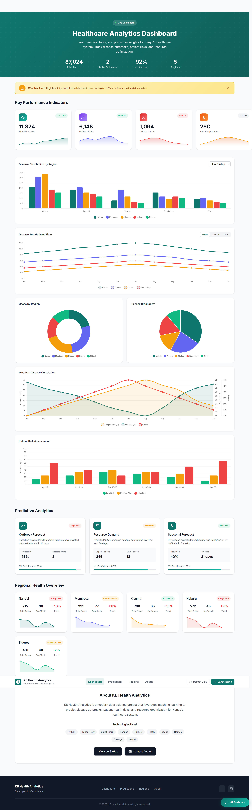
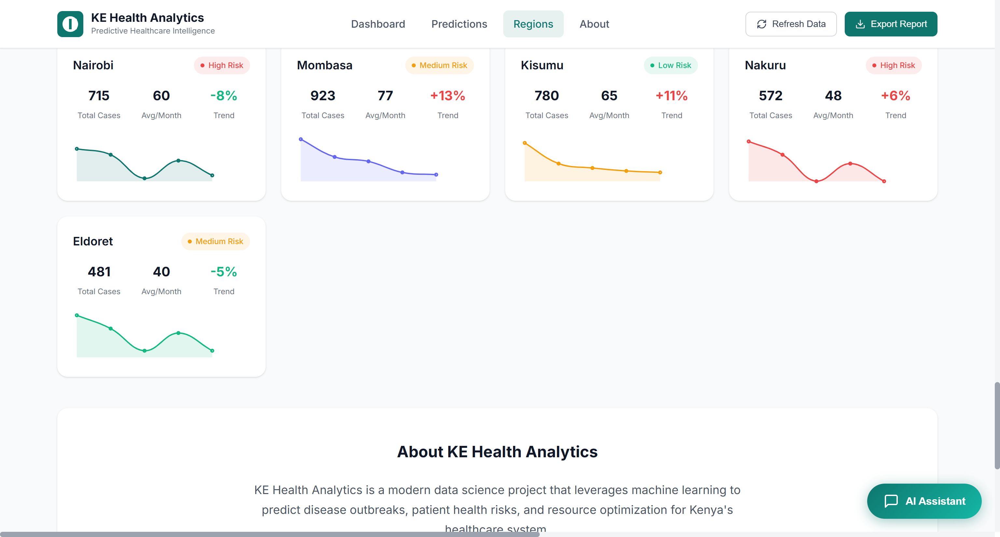
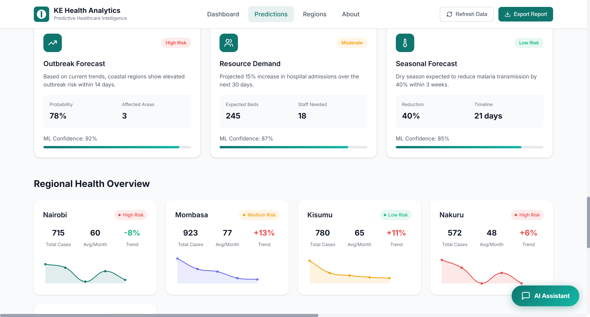
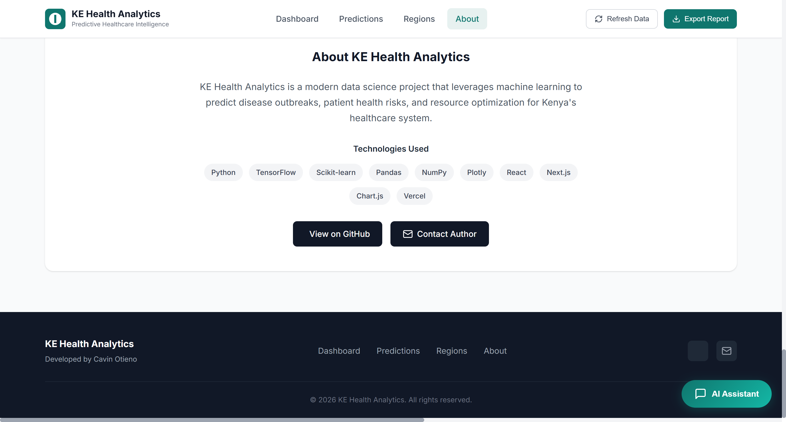

<!-- Header Badges -->
<p align="center">
  
  
  
  
  
  
</p>

# KE Health Analytics - Predictive Healthcare Intelligence

<div align="center">



**Modern data science project leveraging machine learning to predict disease outbreaks, patient health risks, and resource optimization for Kenya's healthcare system.**

**[Live Dashboard](https://ke-health-analytics.vercel.app)** |
**[Documentation](docs/API_REFERENCE.md)** |
**[Report Bug](https://github.com/OumaCavin/ke-health-analytics/issues)** |
**[Request Feature](https://github.com/OumaCavin/ke-health-analytics/issues)**

</div>

## Tech Stack

### Machine Learning & Data Science


### Frontend & Visualization


### Infrastructure & DevOps


## Features

- **Disease Outbreak Prediction** - ML models to predict disease outbreaks based on historical data, weather, and population metrics
- **Patient Risk Assessment** - Risk scoring for maternal health, chronic diseases, and communicable diseases
- **Health Resource Optimization** - Predictive models for bed occupancy, staffing needs, and medical supply demand
- **Interactive Dashboard** - Real-time visualization of health metrics and predictions
- **Regional Health Analysis** - Comprehensive analysis of disease burden across Kenya's regions
- **Weather Correlation** - Understanding the relationship between weather patterns and disease transmission

## Live Dashboard

Experience the interactive healthcare analytics dashboard:

**:link: [https://ke-health-analytics.vercel.app](https://ke-health-analytics.vercel.app)**

The dashboard includes:
- Real-time KPI monitoring
- Disease distribution charts
- Regional health comparisons
- Weather-disease correlation analysis
- Predictive analytics cards
- Patient risk assessment

---

## Dashboard Features Overview

### Disease Distribution by Region



Comprehensive regional health analysis showing disease prevalence across Kenya's counties with interactive filtering capabilities.

### Prediction Analytics



ML-powered predictions for disease outbreaks, patient risk assessment, and resource optimization with confidence intervals.

### About Health Analytics



Detailed information about the platform, methodologies, and data sources used in the health analytics system.

---

## Quick Start

### Python Backend Setup

```bash
# Clone the repository
git clone https://github.com/OumaCavin/ke-health-analytics.git
cd ke-health-analytics

# Create virtual environment
python -m venv venv
source venv/bin/activate  # On Windows: venv\Scripts\activate

# Install dependencies
pip install -r requirements.txt

# Run the demonstration
python main.py

# Or run the quick demo
python demo.py
```

### Dashboard Setup

```bash
# Navigate to dashboard directory
cd dashboard

# Open index.html in browser
# Or serve with any static file server
python -m http.server 8000
```

## Deployment

### Deploy Dashboard to Vercel

#### Option 1: One-Click Deploy

[](https://vercel.com/new/clone?repository-url=https://github.com/OumaCavin/ke-health-analytics&project-name=ke-health-analytics&repository-name=ke-health-analytics&demo-title=KE%20Health%20Analytics&demo-description=Predictive%20Healthcare%20Intelligence%20Dashboard)

#### Option 2: Manual Deploy

```bash
# Install Vercel CLI
npm install -g vercel

# Login to Vercel
vercel login

# Deploy the dashboard
cd dashboard
vercel

# Deploy to production
vercel --prod
```

#### Option 3: GitHub Integration

1. Push your code to GitHub
2. Go to [vercel.com/new](https://vercel.com/new)
3. Import your repository
4. Configure the project:
   - Framework Preset: Other
   - Root Directory: `./dashboard`
5. Click Deploy

### Environment Variables

Create a `.env.local` file in the dashboard directory:

```env
# Analytics (optional)
NEXT_PUBLIC_GA_ID=your-google-analytics-id

# API Endpoints (if using backend)
NEXT_PUBLIC_API_URL=https://your-api-url.com
```

### Vercel Configuration

The `dashboard/vercel.json` file is preconfigured with:
- SPA routing support
- Security headers
- Asset caching

## Project Structure

```
ke-health-analytics/
├── .github/
│   └── workflows/          # CI/CD pipelines
│       ├── ci.yml          # Continuous Integration
│       └── deploy.yml      # Vercel Deployment
├── dashboard/              # Frontend dashboard
│   ├── css/               # Stylesheets
│   ├── js/                # JavaScript
│   ├── assets/            # Static assets
│   ├── index.html         # Main entry point
│   └── vercel.json        # Vercel configuration
├── screenshots/            # Dashboard screenshots
├── src/                   # Python backend
│   ├── data/             # Data loading & preprocessing
│   ├── features/          # Feature engineering
│   ├── models/            # ML models
│   └── visualization/      # Visualization utilities
├── tests/                 # Unit tests
├── config/                # Configuration files
├── docs/                  # Documentation
├── main.py               # Main entry point
├── demo.py               # Quick demonstration
├── analysis.py            # Insights generation
├── requirements.txt       # Python dependencies
├── setup.py              # Package setup
├── CHANGELOG.md          # Version history
├── CONTRIBUTING.md        # Contribution guidelines
└── README.md             # This file
```

## Usage Examples

### Disease Prediction

```python
from src.data.loader import get_sample_health_data
from src.data.preprocessing import clean_data, split_data, encode_categorical
from src.features.engineering import create_disease_features
from src.models.prediction import DiseasePredictor

# Load and prepare data
data = get_sample_health_data()
cleaned = clean_data(data)
featured = create_disease_features(cleaned)
encoded = encode_categorical(featured, ["region", "disease_type"])

# Prepare features and target
X = encoded[["age", "cases", "temperature", "humidity"]]
y = encoded["high_case_load"]

# Train model
predictor = DiseasePredictor(model_type="random_forest")
predictor.train(X, y)

# Make predictions
predictions = predictor.predict(X)
```

### Outbreak Forecasting

```python
from src.models.prediction import OutbreakForecaster

# Create forecaster
forecaster = OutbreakForecaster(forecast_horizon=7)

# Fit on historical data
forecaster.fit(monthly_cases_series)

# Generate forecasts
forecasts = forecaster.forecast()
alerts = forecaster.get_alert_levels(forecasts)
```

## API Reference

See [API_REFERENCE.md](docs/API_REFERENCE.md) for complete API documentation.

## Contributing

Contributions are welcome! Please read our [Contributing Guidelines](CONTRIBUTING.md) before submitting a pull request.

1. Fork the repository
2. Create a feature branch: `git checkout -b feature/amazing-feature`
3. Commit your changes: `git commit -m 'feat: add amazing feature'`
4. Push to the branch: `git push origin feature/amazing-feature`
5. Open a Pull Request

## License

This project is licensed under the MIT License - see the [LICENSE](LICENSE) file for details.

## Author

**Cavin Otieno**
- GitHub: [@OumaCavin](https://github.com/OumaCavin)
- Email: [cavin.otieno012@gmail.com](mailto:cavin.otieno012@gmail.com)
- LinkedIn: [Cavin Otieno](https://linkedin.com/in/cavin-otieno)

## Acknowledgments

- Kenya Ministry of Health for public health data patterns
- Open source data science community
- All contributors and supporters

## Support

If you found this project useful, please give it a :star:

---

<p align="center">
  Made with :heart: by <a href="https://github.com/OumaCavin">Cavin Otieno</a>
</p>
